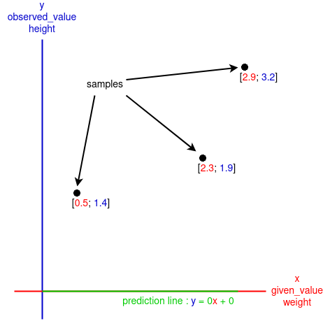
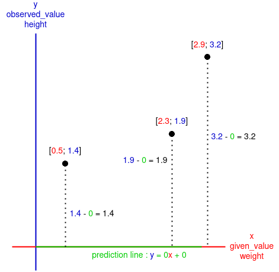
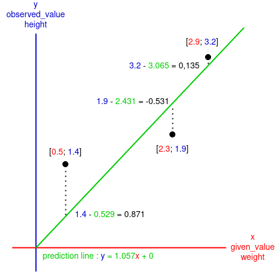
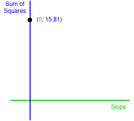
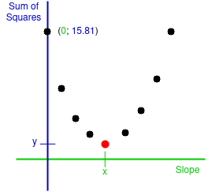
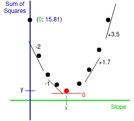
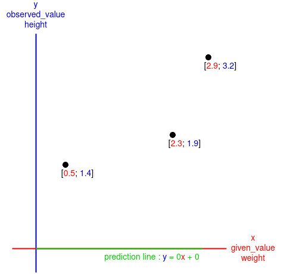
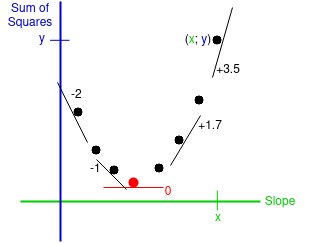
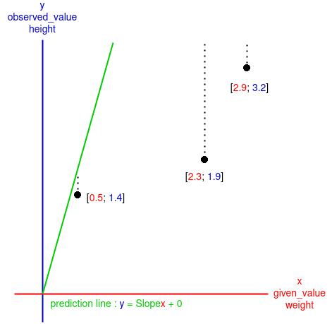
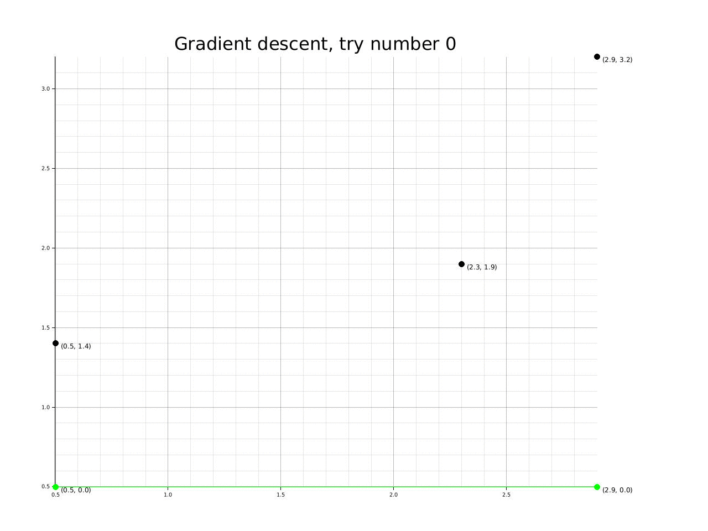

 <center><h2><ins>Gradient-descent-for-Runst</ins></h2></center>

The program here is the adaptation of Josh Starmer's video:
[](https://www.youtube.com/watch?v=sDv4f4s2SB8&t)

___

As I am blocking at coding the backpropagation algorithm in this video:
[](https://www.youtube.com/watch?v=GKZoOHXGcLo&t)
And as I am indeed going totally bonkers I have to step back and rethink what I have learned so far.

To be 100% sure of what is about gradient descent I will try to explain it.

But I will also try to make some hypotheses of what should be added to the gradient descent algorithm to work in a neural network, at least the one in the video mentioned earlier...

<ins>The goal of gradient descent:</ins>\
The goal of gradient descent is to determine the intercept and the slope of a "prediction line", here the line predict the $\color{blue}height$ of someone by giving her or his $\color{red}weight$.

But the algorithm need some samples in order to have a grasp of how this line must look, in terms of intercept and slope, those sample are the given $\color{red}weight$ of three peoples and their observed $\color{blue}height$.

First, the algorithm will have a given initial guess, those are stored in ```slope_intercept```, there are initialised as two $\color{green}0$ but they can be others values like negative one or even randomly declared.

With the guest value of the slope ( $\color{green}0$ ) and the intercept ( $\color{green}0$ ) the algorithm will create a $\color{green}\textrm{prediction line}$ on a xy axis. The algorithm will also put some dot which shows the three samples (peoples) on the axis with $\color{red} x = given_-value = weight$ and $\color{blue} y = observed_-value = height$:

<p align="center">
    
</p>

The goal of this algorithm is to change the position of the $\color{green} \textrm{prediction line}$ to minimize as much as possible the difference between $\color{blue} y  \color{red} _{\textrm{given-value}}$ and $\color{blue} y \color{green} _{\textrm{prediction line}}$ (the difference between  $\textrm{\color{blue} the observed value \color{red}from the given value}$ and $\textrm{\color{green}what the algorithm should \color{blue}find \color{red}from the given value}$) ```for``` each samples:

<p align="center">
    
</p>

Now we know for each samples how much the $\color{green} \textrm{prediction line}$ fit to $\textrm{\color{blue}the observed value}$. 
But we want to know from a general perspective how much the $\color{green} \textrm{prediction line}$ fit to $\textrm{\color{blue}the observed values}$, to do so we sum up all of the differences calculated. 

___
<center><ins>Note:</ins></center>

Sometimes the $\color{green} \textrm{prediction line}$ may look like this:

<p align="center">
    
</p>

If we make the sum of the difference we will get: $$\textrm{sum} = 0.871 + (-0.531) + 0.135$$ $$=> \textrm{sum} = 0.475$$

But that doesn't make sense because the result is lower than the difference between $\color{blue} 1.4$ and $\color{green} 0.529$, which is $0.871$, adding the others differences lower it instead of increase it.

The solution to this is to make sure the diffrences are positive by calculating the square of the negative one: $$\textrm{sum} = 0.871 + (-0.531)^2 + 0.135$$

But we also need to calculate the square of positive differences to keep a sense of proportionality between the differences: $$\textrm{sum of squares} = 0.871^2 + (-0.531)^2 + 0.135^2$$ $$=> \textrm{sum of squares} = 1.059$$

<center><ins>End of the note</ins></center>

___

The sum of square for the main exemple:
$$\textrm{sum of squares} = (1.4)^2 + (1.9)^2 + (3.2)^2$$ $$=> \textrm{sum of squares} = 15.81$$

Now that we have the $\textrm{\color{blue}Sum of Squares}$ from the given $\textrm{\color{green}Slope}$, which is $\color{green} 0$, we can put it in another graph:

<p align="center">
    
</p>

___
<center><ins>Note</ins></center>

In the calculation of the Gradient descent the $\textrm{Slope}$ and the $\textrm{Intercept}$ of the $\color{green} \textrm{prediction line}$ will both influence the way the $\color{green} \textrm{line}$ fit to $\textrm{\color{blue}the observed values}$.

To be efficient we need to calculate the $\textrm{sum of squares}$ with respect to the $\textrm{Slope}$ and the $\textrm{Intercept}$ separately.

<center><ins>End of the note</ins></center>

___

As mentioned before we want to reduce as much as possible the sum of the differences between $\textrm{\color{blue} the observed values \color{red}from the given values}$ and $\textrm{\color{green}what the algorithm should \color{blue}find \color{red}from the given values}$ which is: $\textrm{sum of squares}$.

To know which $\textrm{\color{blue}Sum of Squares}$ is the nearest to $\color{blue}0$ we have to take account of the others:

<p align="center">
    
</p>

Here we can see the lowest sum of differences, $\textrm{\color{blue}Sum of Squares}$, is $\textrm{\color{blue}y}$ with respect to a value $\textrm{\color{green}x}$ for the $\textrm{\color{green}Slope}$.

So good so far we have found, theoretically, the best value for the $\textrm{\color{green}Slope}$ from there we can deduct the problems this method creates:
1. This method could take an infinite amount of time if we don't choose how much we want the $\textrm{\color{blue}Sum of Squares}$ to be near $0$, in terms of numbers of $0$ after the decimal point, $0.\textrm{\color{blue}y}$ or $0.00\textrm{\color{blue}y}$ ?
2. Testing all the values of the $\textrm{\color{green}Slope}$ to guess the lowest value of the $\textrm{\color{blue}Sum of Squares}$ would take a monstrous amount of time.

In Josh's video about gradient descent(link in the introduction) the number to represent how much we want $\textrm{\color{blue}Sum of Squares}$ to be near $0$ is set to $0.001$, this value is stored in the variable ```precision_success```.

If we want to reduce the number of tests to guess the $\textrm{\color{green}Slope}$ we would need another variable to build a logic, a variable that would change in the same direction as long as we are approaching the good value of the $\textrm{\color{green}Slope}$.

This variable is the derivative of the $\textrm{\color{blue}sum of squares}$ with respect to the $\textrm{\color{green}Slope}$:

<p align="center">
    
</p>

Here we can see the lowest value of the $\textrm{\color{blue}Sum of Squares}$, the value we are aiming for in order to find the good value of the $\textrm{\color{green}Slope}$, with a derivative of $\color{red}0$.
And we can see the derivative of the $\textrm{\color{blue}Sum of Squares}$ approaching $\color{red}0$ as long as we are reaching the value of the $\textrm{\color{green}Slope}$ we want.

That mean more the derivative is far from $\color{red}0$ more the "size of the step" we will take to try calculating the next value of $\textrm{\color{blue}Sum of Squares}$ with respect to the $\textrm{\color{green}Slope}$ can be large:

With the current exemple:
___
<center><ins>Note</ins></center>

Here a recape before calculating the derivative of $\textrm{\color{blue}Sum of Squares}$:

To calculate the $\textrm{\color{blue}Sum of Squares}$ we did:

$$\textrm{\color{blue}Sum of Squares} = (1.4)^2 + (1.9)^2 + (3.2)^2$$ 
This came from:
$$\textrm{\color{blue}Sum of Squares} = (\color{red}1.4 \color{black} - \color{green}0 \color{black})^2 + (\color{red}1.9 \color{black}- \color{green}0\color{black})^2 + (\color{red}3.2 - \color{green}0\color{black})^2$$ 

In a more generale way:

$$\textrm{\color{blue}Sum of Squares} = \sum\limits_{i=1}^N (\textrm{\color{blue}the observed value y}_i \textrm{ \color{red}from the given value x}_i - \textrm{\color{green}the value y}_i \textrm{ \color{green}the algorithm should \color{blue}find \color{red}from the given value x}_i)^2$$

$\sum\limits_{i=1}^N x_i=>$ The sum of every $x$ elements (like calculations) from the first $i$, here $i = 1$, until $i = N$, $i$ increas of $1$ every $x$ elements. In programing it gives something like: 

```rust
for i in 1..= N {
    x = // can be any calculation that involve i
    sum = x + sum;
}
``` 

But if $i$ is use to manipulate an array its better to shift everything by one because an array start with the number $0$:

```rust
for i in 0..= N - 1 {
    x = // can be any calculation that involve i
    sum = x + sum;
}
```

$N => \textrm{Number of samples}$

$i => \textrm{Number of the first sample}$

$\textrm{\color{blue}the observed value y}_i \textrm{ \color{red}from the given value x}_i =>$ this value is known as the value $\color{blue} y$ of the observed sample $_i$

$\textrm{\color{green}the value y}_i \textrm{ \color{green}the algorithm should \color{blue}find \color{red}from the given value x}_i =>$ this value is calculated by the algorithm with the $\color{green} \textrm{prediction line}$ which formula is $\color{green}y = slope * x + intercept$.

$^2 =>$ We need a positive value. 

With those info we can rewrite the formula of $\textrm{\color{blue}Sum of Squares}$:

$$\textrm{\color{blue}Sum of Squares} = \sum\limits_{i=1}^N (\textrm{\color{blue}observed sample}_i - \color{green}slope * x_i + intercept\color{black})^2$$

But as $\sum$ expresse just a sumation and considering the fact that  the $\textrm{\color{blue}sum}$ of the derivatives $\textrm{\color{blue}of Squares}$ with respect to the $\textrm{\color{green}Slope (or intercept)}$ is the same as the derivative of the $\textrm{\color{blue}sum of squares}$ with respect to the $\textrm{\color{green}Slope (or intercept)}$, we can conclud this symbole is not usefull to calculate the dérivative:

$$\textrm{\color{blue}Square} = (\textrm{\color{blue}observed sample} - \color{green}slope * x + intercept\color{black})^2$$

We will calculat the dérivatives of the $\textrm{\color{blue}Squares}$ from this formula and make the sum of them to get the derivative of the $\textrm{\color{blue}Sum of Squares}$.

<center><ins>End of the note</ins></center>

___

Here is the math to calculat the derivative of $\textrm{\color{blue}Square}$ with respect to the $\textrm{\color{green}Slope}$:

We can't do it directly, we have to use the chain rule taking note that the $\textrm{\color{green}Slope}$ incluence the $\color{red} \textrm{\color{red}Prediction line}$ who influence the $\color{blue}Square$.

$$\frac{\partial \color{blue}Square}{\partial \color{green} Slope} = \frac{\partial \color{blue}Square}{\partial \color{red} \textrm{\color{red}Prediction line}} * \frac{\partial \textrm{\color{red}Prediction line}}{\partial \color{green} Slope}$$

$$\frac{\partial \color{blue}Square}{\partial \color{red} \textrm{\color{red}Prediction line}} => \color{blue}Square \color{black} = (\textrm{\color{blue}observed sample} - \textrm{\color{red}Prediction line} \color{black}))^2$$

$$=> \color{blue}Square \color{black} = (\textrm{\color{blue}observed sample} + (\color{green}-1 * \textrm{\color{red}Prediction line} \color{black}))^2$$

$$=> 2*(\textrm{\color{blue}observed sample} + (\color{green}-1 * \textrm{\color{red}Prediction line} \color{black}))$$

Since the derivative is with respect to the $\textrm{\color{red}Prediction line}$:

$$\frac{\partial \color{blue}Square}{\partial \color{red} \textrm{\color{red}Prediction line}} =  2*(\textrm{\color{blue}observed sample} + (\color{green}-1 *  \textrm{\color{red}Prediction line} \color{black}))\color{green}* -1$$

$$=> \color{green}-1 * 2*(\textrm{\color{blue}observed sample} + (\color{green}-1 *  \textrm{\color{red}Prediction line} \color{black}))$$

$$\frac{\partial \color{blue}Square}{\partial \color{red} \textrm{\color{red}Prediction line}} = \color{green}-2*(\textrm{\color{blue}observed sample} - \textrm{\color{red}Prediction line} \color{black})$$

And:

$$\frac{\partial \textrm{\color{red}Prediction line}}{\partial \color{green} Slope} => \textrm{\color{red}Prediction line} = \color{green} Slope \color{black} * x + intercept$$

$$\frac{\partial \textrm{\color{red}Prediction line}}{\partial \color{green} Slope} = x$$

Note: Here $x$ is the $\textrm{\color{red}given value}$, the $\textrm{\color{red}weight}$.

$$\frac{\partial \textrm{\color{red}Prediction line}}{\partial \color{green} Slope} = \textrm{\color{red}given value}$$

Finally:

$$\frac{\partial \color{blue}Square}{\partial \color{green} Slope} = \frac{\partial \color{blue}Square}{\partial \color{red} \textrm{\color{red}Prediction line}} * \frac{\partial \textrm{\color{red}Prediction line}}{\partial \color{green} Slope}$$

$$\frac{\partial \color{blue}Square}{\partial \color{green} Slope} = \color{green}-2*(\textrm{\color{blue}observed sample} - \textrm{\color{red}Prediction line} \color{black}) * \textrm{\color{red}given value}$$

$$= \color{green}-2\textrm{\color{red}given value} * (\textrm{\color{blue}observed sample} - \textrm{\color{red}Prediction line} \color{black})$$

Note: for $\textrm{\color{blue}observed sample}$ and $\textrm{\color{red}Prediction line}$ we are using their $y$ value to calculate the differences:

<p align="center">
    
</p>

With the samples of the example :

$$\textrm{\color{blue} derivative square}_1 \color{black} = -2 * \color{red}0.5 \color{black} * (\color{blue}1.4 - (\color{green}0 * \color{red}0.5\color{green} + 0 \color{black}))$$

$$= -2 * \color{red}0.5 \color{black} * (\color{blue}1.4 - \color{green}0 \color{black})$$

$$= -1 * 1.4$$

$$= -1.4$$

$$\textrm{\color{blue} derivative square}_2 \color{black} = -2 * \color{red}2.3 \color{black} * (\color{blue}1.9 - (\color{green}0 * \color{red}2.3\color{green} + 0 \color{black}))$$

$$= -2 * \color{red}2.3 \color{black} * (\color{blue}1.9 - \color{green}0 \color{black})$$

$$= -4.6 * 1.9$$

$$= -8.74$$

$$\textrm{\color{blue} derivative square}_3 \color{black} = -2 * \color{red}2.9 \color{black} * (\color{blue}3.2 - (\color{green}0 * \color{red}2.9\color{green} + 0 \color{black}))$$

$$= -2 * \color{red}2.9 \color{black} * (\color{blue}3.2 - \color{green}0 \color{black})$$

$$= -5.8 * 3.2$$

$$= -18.56$$

$$\textrm{\color{blue} sum derivatives squares} \color{black} = -1.4 + (-8.74) + (-18.56)$$

$$= -28.7$$

The goal is to find a way to decreas this value until it's reach $0$ as much as we declared it in the variable ```precision_success```, 0.001.

The $\textrm{\color{blue} sum derivatives squares}$ tells us how much we are fram for it but also how much we can move forward in order to reach it.

But $-28.7$ is a value too big compared to the values of the samples and the potential good $\color{green} Slope$, this is even more important since we want to guess a values very sensitive to changes.

This why there is something caled $\textrm{Learning rate}$ which goal is to lower the value given by the $\textrm{\color{blue} sum derivatives squares}$, for the $\color{green} Slope$ the $\textrm{Learning rate}$ is set to $0.01$:

$$\textrm{Step size} = \textrm{\color{blue} sum derivatives squares} * \textrm{Learning rate}$$

$$= -28.7 * 0.01$$

$$= -0.287$$

Now we know how much we have to change the value of the $\color{green} Slope$ to make the $\textrm{\color{green}Prediction line}$ fit a little more to the samples.

But should we add the $\textrm{Step size}$ to the $\color{green} Slope$ or substract it?

For now, the $\textrm{\color{green}Prediction line}$ is here:

<p align="center">
    
</p>

If we want the $\textrm{\color{green}Prediction line}$ to fit a little more to the samples we need to raise the $\color{green} Slope$.

Since $\textrm{\color{blue} sum derivatives squares}$, $-0.287$, is negative we can't make an addition:

$$\textrm{\color{green}new Slope} = \textrm{current Slope} - \textrm{\color{blue} sum derivatives squares}$$

$$= 0 - (-0.287)$$

$$= 0 + 0.287$$

$$= 0.287$$

___

<center><ins>Note</ins></center>

This also work if the value of $\textrm{\color{blue} sum derivatives squares}$ is positive, that would mean the $\color{green} Slope$ is too high:

<p align="center">
    
</p>

<p align="center">
    
</p>

In that case we would like to lower the $\color{green} Slope$:

$$\textrm{\color{green}new Slope} = \textrm{current Slope} - \textrm{\color{blue} sum derivatives squares}$$

<center><ins>End of the note</ins></center>

___

We have the the new value of the $\color{green} Slope$ which is $0.287$.
Before guessing the next value of the $\color{green} Slope$, need to try to guesse the next value the $\color{green}Intercept$ would be.

First we calculate the $\textrm{\color{blue}sum derivatives squares}$ with respect to the $\color{green}Intercept$ but before we have to apply the chain rule:

$$\frac{\partial \color{blue}Square}{\partial \color{green} Intercept} = \frac{\partial \color{blue}Square}{\partial \color{red} \textrm{\color{red}Prediction line}} * \frac{\partial \textrm{\color{red}Prediction line}}{\partial \color{green} Intercept}$$

$$\frac{\partial \color{blue}Square}{\partial \color{red} \textrm{\color{red}Prediction line}} => \color{blue}Square \color{black} = (\textrm{\color{blue}observed sample} - \textrm{\color{red}Prediction line} \color{black}))^2$$

$$=> \color{blue}Square \color{black} = (\textrm{\color{blue}observed sample} + (\color{green}-1 * \textrm{\color{red}Prediction line} \color{black}))^2$$

$$=> 2*(\textrm{\color{blue}observed sample} + (\color{green}-1 * \textrm{\color{red}Prediction line} \color{black}))$$

Since the derivative is with respect to the $\textrm{\color{red}Prediction line}$:

$$\frac{\partial \color{blue}Square}{\partial \color{red} \textrm{\color{red}Prediction line}} =  2*(\textrm{\color{blue}observed sample} + (\color{green}-1 *  \textrm{\color{red}Prediction line} \color{black}))\color{green}* -1$$

$$=> \color{green}-1 * 2*(\textrm{\color{blue}observed sample} + (\color{green}-1 *  \textrm{\color{red}Prediction line} \color{black}))$$

$$\frac{\partial \color{blue}Square}{\partial \color{red} \textrm{\color{red}Prediction line}} = \color{green}-2*(\textrm{\color{blue}observed sample} - \textrm{\color{red}Prediction line} \color{black})$$

And:

$$\frac{\partial \textrm{\color{red}Prediction line}}{\partial \color{green} Intercept} => \textrm{\color{red}Prediction line} = \color{black} slope  * x + \color{green}Intercept$$

$$=> \textrm{\color{red}Prediction line} = \color{black} slope  * x + \color{blue} 1 *\color{green}Intercept$$

$$\frac{\partial \textrm{\color{red}Prediction line}}{\partial \color{green} Intercept} = \color{blue} 1$$

Finally:

$$\frac{\partial \color{blue}Square}{\partial \color{green} Intercept} = \frac{\partial \color{blue}Square}{\partial \color{red} \textrm{\color{red}Prediction line}} * \frac{\partial \textrm{\color{red}Prediction line}}{\partial \color{green} Intercept}$$

$$\frac{\partial \color{blue}Square}{\partial \color{green} Intercept} = \color{green}-2*(\textrm{\color{blue}observed sample} - \textrm{\color{red}Prediction line} \color{black}) * \color{blue} 1$$

$$= \color{green}-2 * \color{blue} 1 * (\textrm{\color{blue}observed sample} - \textrm{\color{red}Prediction line} \color{black})$$

$$= \color{green}-2 * (\textrm{\color{blue}observed sample} - \textrm{\color{red}Prediction line} \color{black})$$

We can now calculate the $\textrm{\color{blue}sum derivatives squares}$:
Note: the $\color{green} Slope$ is set to $0.287$.

$$\textrm{\color{blue} derivative square}_1 \color{black} = -2 * (\color{blue}1.4 - (\color{green}0.287 * \color{red}0.5\color{green} + 0 \color{black}))$$

$$= -2 * \color{black} (\color{blue}1.4 - \color{green}0.1435 \color{black})$$

$$= -2 * 1.2565$$

$$= -2.513$$

$$\textrm{\color{blue} derivative square}_2 \color{black} = -2 * (\color{blue}1.9 - (\color{green}0.287 * \color{red}2.3\color{green} + 0 \color{black}))$$

$$= -2\color{black} * (\color{blue}1.9 - \color{green}0.6601 \color{black})$$

$$= -2 * 1.2399$$

$$= -2.4798$$

$$\textrm{\color{blue} derivative square}_3 \color{black} = -2 * (\color{blue}3.2 - (\color{green}0.287 * \color{red}2.9\color{green} + 0 \color{black}))$$

$$= -2\color{black} * (\color{blue}3.2 - \color{green}0,8323 \color{black})$$

$$= -2 * 2.3677$$

$$= -4.7354$$

$$\textrm{\color{blue} sum derivatives squares} \color{black} = -2.513 + (-2.4798) + (-4.7354)$$

$$= -9.7282$$

Then we use a $\textrm{Learning rate}$ to lower a bit the value, but not as much as we did for the $\color{green} Slope$ since the $\color{green}Intercept$ is less sensitive to change:

$$\textrm{Step size} = \textrm{\color{blue} sum derivatives squares} * \textrm{Learning rate}$$

$$= -9.7282 * 0.1$$

$$= -0.97282$$

And finally we use the $\textrm{Step size}$ to calculate the new calue of the $\color{green}Intercept$:

$$\textrm{\color{green}new Intercept} = \textrm{current Intercept} - \textrm{\color{blue} sum derivatives squares}$$

$$= 0 - (-0.97282)$$

$$= 0 + 0.97282$$

$$= 0.97282$$

The new formula of the $\textrm{\color{red}Prediction line}$ is now:
$$y = 0.287x + 0.97282$$

And we use this new $\textrm{\color{red}Prediction line}$ to repeat the process again and again until the $\textrm{\color{blue} sum derivatives squares}$ with respect to the $\color{green}Slope$ and the $\textrm{\color{blue} sum derivatives squares}$ with respect to the $\color{green}Intercept$ are both as near to $0$ as we wante, in the code the limit is set to $0.001$.

Here is a little gif to show the process in action:
<p align="center">
    
</p>

___
<center><ins>Additional note:</ins></center>

Values were the good intercept and slope are found (approximately):

(note: the prediction line found by Josh is: $y = a0.64 + 0.95$)
|$(o - p)^x$ only if x is even | Learning rate slope, weight | Learning rate intercept, bias | number of try | prediction line |
|---|---|---|---|---|
|$x = [Idk ; 0.8]$|$0.1$|$1$|$$x = 0.4 => 29$$ $$x = 0.6 => 15$$ $$x = 0.8 => 11$$|$$x = 0.4 => y = a0.6386308534601578 + 0.9544203978150603$$ $$x = 0.6 => y = a0.6420059745625867 + 0.9463511756319674$$ $$x = 0.8 => y = a0.6413166642652045 + 0.9480095319636368$$|
|$x = [0.8 ; 10]$| $0.01$ | $0.1$ | $$x = 0.8 => 260$$ $$x = 2 => 108$$ $$x = 4 => 45$$ $$x = 6 => 22$$ $$x = 8 => 14$$ $$x = 10 => 76$$| $$x = 0.8 => y = a0.6388851834359309 + 0.9537779471330741$$ $$x = 2 => y = a0.6402976217775229 + 0.9504417536953271$$ $$x = 4 => y = a0.6407941148661322 + 0.9492692569668632$$ $$x = 6 => y = a0.6411193057119328 + 0.9484918184754438$$ $$x = 8 =>  y = a0.6410162537466007 + 0.9487414252781016$$ $$x = 10 => y = a0.6412632970776748 + 0.9481394245821886$$|
|$x = [4 ; Idk]$| $0.001$ | $0.01$ | $$x = 74 => 17$$ $$x = 76 => 13$$ $$x = 78 => 15$$| $$x = 74 => y = a0.6410281505131493 + 0.9487118147668387$$ $$x = 76 => y = a0.6410259248302264 + 0.9487172715442852$$ $$x = 78 => y = a0.6410264020927565 + 0.9487161255313094$$|