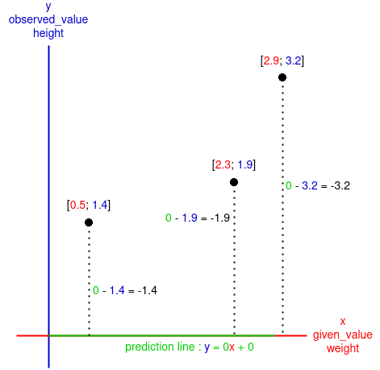

<center><h2><ins>Gradient-descent-for-Runst</ins></h2></center>

The program here is the adaptation of Josh Starmer's video:
[](https://www.youtube.com/watch?v=sDv4f4s2SB8&t)

___

As I am blocking at coding the backpropagation algorithm in this video:
[](https://www.youtube.com/watch?v=GKZoOHXGcLo&t)
And as I am indeed going totally bonkers I have to step back and rethink what I have learned so far.

To be 100% sure of what is about gradient descent I will try to explain it.

But I will also try to make some hypotheses of what should be added to the gradient descent algorithm to work in a neural network, at least the one in the video mentioned earlier...

<ins>The goal of gradient descent:</ins>\
The goal of gradient descent is to determine the intercept and the slope of a "prediction line", here the line predict the $\color{blue}height$ of someone by giving her or his $\color{red}weight$.

But the algorithm need some samples in order to have a grasp of how this line must look, in terms of intercept and slope, those sample are the given $\color{red}weight$ of three peoples and their observed $\color{blue}height$.

First, the algorithm will have a given initial guess, those are stored in ```slope_intercept```, there are initialised as two $\color{green}0$ but they can be others values like negative one or even randomly declared.

With the guest value of the slope ($\color{green}0$) and the intercept ($\color{green}0$) the algorithm will create a $\color{green} \textrm{prediction line} $ on a xy axis. The algorithm will also put some dot which shows the three samples (peoples) on the axis with $\color{red} x = given_-value = weight$ and $\color{blue} y = observed_-value = height$:\

<p align="center">
    
</p>

The goal of this algorithm is to change the position of the $\color{green} \textrm{prediction line}$ to minimize as much as possible the difference between $\color{blue} y \color{green} _{\textrm{prediction line}}$ and($-$) $\color{blue} y \color{red} _{given_-value = weight}$ (the difference between $\textrm{\color{green}what the algorithm should \color{blue} find \color{red} from the given value}$ and($-$) $\textrm{\color{blue} the observed value \color{red} from the given value}$) for each samples:\

<p align="center">
    
</p>

___
<center><ins>Note:</ins></center>

Sometimes the line may look like this 
___


In a neural network...

how to fit the line to the. data, least square

