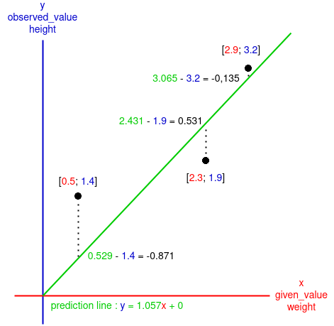

<center><h2><ins>Gradient-descent-for-Runst</ins></h2></center>

The program here is the adaptation of Josh Starmer's video:
[](https://www.youtube.com/watch?v=sDv4f4s2SB8&t)

___

As I am blocking at coding the backpropagation algorithm in this video:
[](https://www.youtube.com/watch?v=GKZoOHXGcLo&t)
And as I am indeed going totally bonkers I have to step back and rethink what I have learned so far.

To be 100% sure of what is about gradient descent I will try to explain it.

But I will also try to make some hypotheses of what should be added to the gradient descent algorithm to work in a neural network, at least the one in the video mentioned earlier...

<ins>The goal of gradient descent:</ins>\
The goal of gradient descent is to determine the intercept and the slope of a "prediction line", here the line predict the $\color{blue}height$ of someone by giving her or his $\color{red}weight$.

But the algorithm need some samples in order to have a grasp of how this line must look, in terms of intercept and slope, those sample are the given $\color{red}weight$ of three peoples and their observed $\color{blue}height$.

First, the algorithm will have a given initial guess, those are stored in ```slope_intercept```, there are initialised as two $\color{green}0$ but they can be others values like negative one or even randomly declared.

With the guest value of the slope ($\color{green}0$) and the intercept ($\color{green}0$) the algorithm will create a $\color{green} \textrm{prediction line} $ on a xy axis. The algorithm will also put some dot which shows the three samples (peoples) on the axis with $\color{red} x = given_-value = weight$ and $\color{blue} y = observed_-value = height$:

<p align="center">
    
</p>

The goal of this algorithm is to change the position of the $\color{green} \textrm{prediction line}$ to minimize as much as possible the difference between $\color{blue} y \color{green} _{\textrm{prediction line}}$ and $\color{blue} y  _{\color{red} given_-value}$ (the difference between $\textrm{\color{green}what the algorithm should \color{blue} find \color{red} from the given value}$ and $\textrm{\color{blue} the observed value \color{red} from the given value}$) ```for``` each samples:

<p align="center">
    
</p>

Now we know for each samples how much the $\color{green} \textrm{prediction line}$ fit to $\textrm{\color{blue}the observed value}$. 
But we want to know from a general perspective how much the $\color{green} \textrm{prediction line}$ fit to $\textrm{\color{blue}the observed values}$, to do so we sum up all of the differences calculated. 

___
<center><ins>Note:</ins></center>

Sometimes the $\color{green} \textrm{prediction line}$ may look like this:

<p align="center">
    
</p>

If we make the sum of the difference we will get: $$\textrm{sum} = -0.871 + 0.531 + (-0.135)$$ $$=> \textrm{sum} = -0.475$$

But that doesn't make sense because the result is lower than the difference between $\color{green} 2.431$ and $\color{blue} 1.9$, which is $0.531$, adding the others differences lower it instead of increase it.

The solution to this is to make sure the diffrences are positive by calculating the square of the negative one: $$\textrm{sum} = (-0.871)^2 + 0.531 + (-0.135)^2$$

But we also need to calculate the square of positive differences to keep a sense of proportionality between the differences: $$\textrm{sum} = (-0.871)^2 + 0.531^2 + (-0.135)^2$$ $$=> \textrm{sum} = 1.059$$
<center><ins>End of the note</ins></center>

___

The sum of square is for the main exemple:
$$\textrm{sum of squares} = (-1.4)^2 + (-1.9)^2 + (-3.2)^2$$ $$=> \textrm{sum of squares} = 15.81$$

Now that we have the sum of square we can put it in another graph, a 3D one:


In a neural network...

how to fit the line to the. data, least square

___
<center><ins>Additional note:</ins></center>

